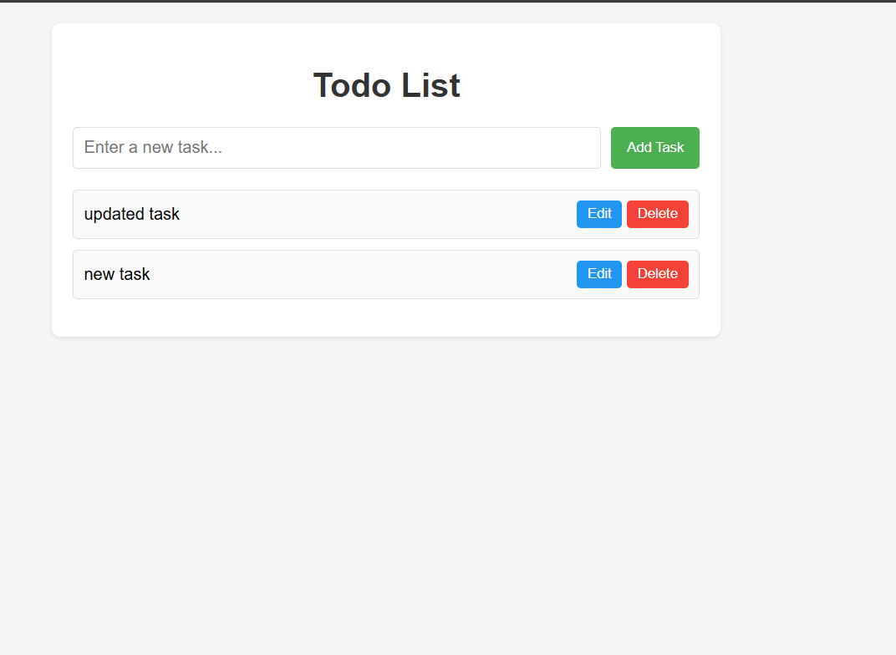

# Simple Todo List Application

A simple todo list application built with HTML, CSS, and JavaScript that allows users to add, edit, and delete tasks. Tasks are persisted in the browser's localStorage.

## Features

- Add new tasks
- Edit existing tasks
- Delete tasks
- Tasks persist between page refreshes (using localStorage)

## Screenshots

## How to Run

1. Clone this repository or download the files
2. Open the `index.html` file in your web browser
3. Start adding tasks!

## Technologies Used

- HTML
- CSS
- JavaScript
- localStorage for data persistence