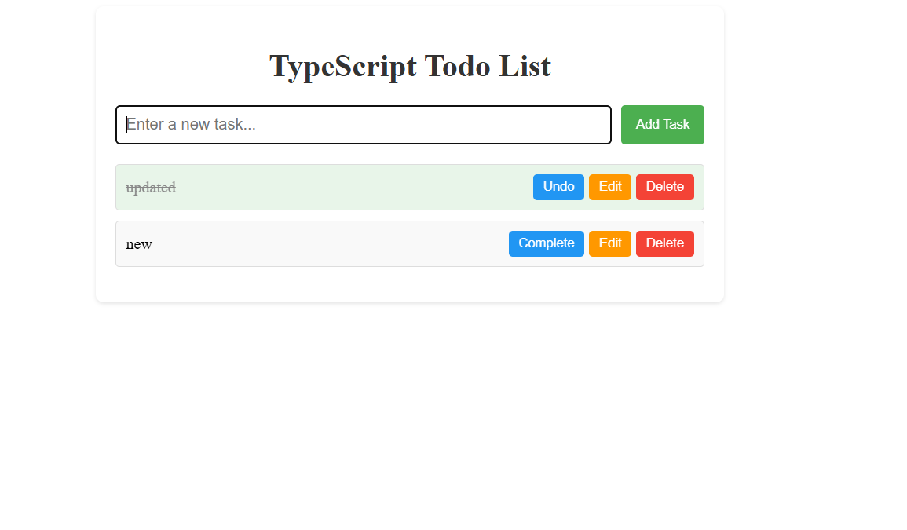

# TypeScript Todo List Application

A todo list application built with TypeScript that demonstrates type safety and object-oriented programming principles.

## Features

- Add new tasks with automatic ID generation
- Mark tasks as complete/incomplete
- Edit existing tasks
- Delete tasks
- Persistent storage using localStorage
- Type-safe implementation with TypeScript interfaces
- Object-oriented architecture

## Screenshots

## Installation

1. Clone the repository
2. Install dependencies (if any): `npm install`
3. Compile TypeScript: `tsc`
4. Open `index.html` in your browser

## TypeScript Features Used

- Interfaces (`TodoItem`)
- Classes (`TodoList`)
- Type annotations
- Access modifiers (`private`)
- Type assertions (DOM elements)
- Strict type checking

## How to Run

1. Make sure you have TypeScript installed globally: `npm install -g typescript`
2. Compile the TypeScript code: `tsc`
3. Open `index.html` in your web browser

